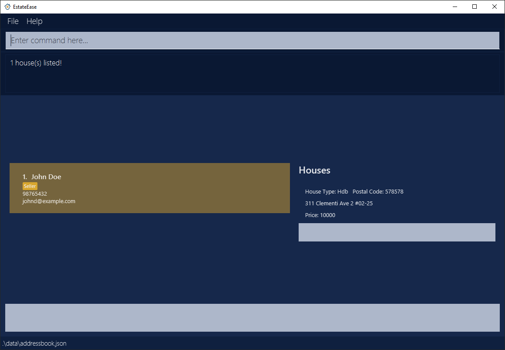
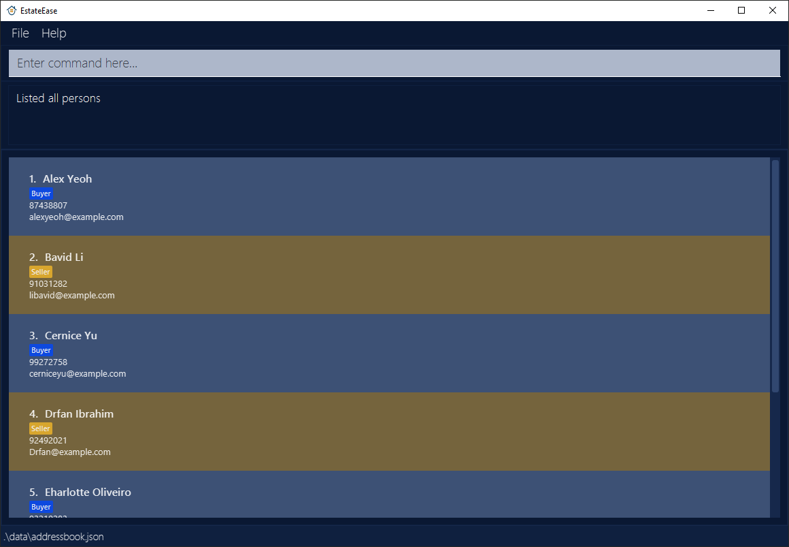
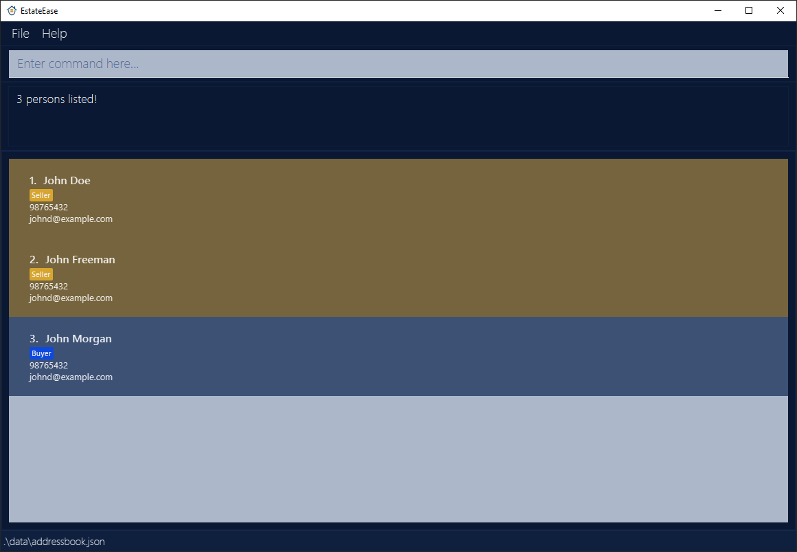

# EstateEase User Guide

EstateEase is a **desktop app for managing contacts, optimized for use via a  Line Interface** (CLI) while still having the benefits of a Graphical User Interface (GUI). If you can type fast, Estate Ease can get your contact management tasks done faster than traditional GUI apps.

<!-- * Table of Contents -->
<page-nav-print />

--------------------------------------------------------------------------------------------------------------------

## Quick start

1. Ensure you have Java `11` or above installed in your Computer.

1. Download the latest `EstateEase.jar` from [here](https://github.com/AY2324S2-CS2103-F09-1/tp/releases).

1. Copy the file to the folder you want to use as the _home folder_ for your EstateEase.

1. Open a command terminal, `cd` into the folder you put the jar file in, and use the `java -jar EstateEase.jar` command to run the application.<br>
   A GUI similar to the below should appear in a few seconds. Note how the app contains some sample data.<br>
   

1. Type the command in the command box and press Enter to execute it. e.g. typing **`help`** and pressing Enter will open the help window.<br>
   Some example commands you can try:

   * `list` : Lists all contacts.

   * `addSeller n/John Doe p/98765432 e/johnd@example.com type/Hdb street/Clementi Ave 2 blk/311 level/02 unitNo/25 postal/578578 price/999999999` : Adds a seller named `John Doe` with a `House` to EstateEase.

   * `delete 3` : Deletes the 3rd contact shown in the current list.

   * `matchBuyer Alice Lim` : Display Seller details with House that match the Budget and HousingType of the Buyer named `Alice Lim` in EstateEase.

   * `clear` : Deletes all contacts.

   * `exit` : Exits the app.

1. Refer to the [Features](#features) below for details of each command.

--------------------------------------------------------------------------------------------------------------------

## Features

<box type="info" seamless>

**Notes about the command format:**<br>

* Words in `UPPER_CASE` are the parameters to be supplied by the user.<br>
  e.g. in `addBuyer n/NAME`, `NAME` is a parameter which can be used as `addBuyer n/John Doe`.

* Items in square brackets are optional.<br>
  e.g `n/NAME [t/TAG]` can be used as `n/John Doe t/friend` or as `n/John Doe`.

* Items with `…`​ after them can be used multiple times including zero times.<br>
  e.g. `[t/TAG]…​` can be used as ` ` (i.e. 0 times), `t/friend`, `t/friend t/family` etc.

* Parameters can be in any order.<br>
  e.g. if the command specifies `n/NAME p/PHONE_NUMBER`, `p/PHONE_NUMBER n/NAME` is also acceptable.

* Extraneous parameters for commands that do not take in parameters (such as `help`, `list`, `exit` and `clear`) will be ignored.<br>
  e.g. if the command specifies `help 123`, it will be interpreted as `help`.

* If you are using a PDF version of this document, be careful when copying and pasting commands that span multiple lines as space characters surrounding line-breaks may be omitted when copied over to the application.
</box>

### Viewing help : `help`

Shows a message explaning how to access the help page.


Format: `help`

### Adding a buyer: `addBuyer`

Adds a `Buyer` to EstateEase.

Format: `addBuyer [n/NAME] [p/PHONE_NUMBER] [e/EMAIL] [budget/BUDGET] [type/HOUSING_TYPE]`

<box type="tip" seamless>

**Note:**
- `Budget` and `Housing_type` are the housing requirement preferences for every `Buyer`, so that `Buyer` and `Seller` can be matched immediately if their preference matched.
- A `Buyer` cannot have the same name as a `Seller`, because a `Buyer` cannot be a `Seller`, they must be unique.
  </box>

Examples:
* `addBuyer n/James p/98765432 e/james@gmail.com budget/20000 type/Hdb`
* `addBuyer n/James p/98765432 e/james@gmail.com budget/20000 type/Condominium`
* `addBuyer n/James p/98765432 e/james@gmail.com budget/20000 type/Condominium`
* `addBuyer n/James p/98765432 e/james@gmail.com budget/20000 type/Landed`


### Adding a seller: `addSeller`

Adds a `Seller` to EstateEase.

Format: `addSeller [n/NAME] [p/PHONE_NUMBER] [e/EMAIL] [type/HOUSING_TYPE] [street/STREET] [blk/BLOCK] [level/LEVEL] [unitNo/UNIT_NUMBER] [postal/POSTAL_CODE] [price/HOUSE_PRICE]`

<box type="tip" seamless>

**Note:**
- Adding a `Seller` will add a `House` to his/her list of houses, so that `Seller` and `Buyer` can be matched immediately if their preference matched.
- A `Seller` cannot have the same name as a `Buyer`, because a `Seller` cannot be a `Buyer`, they must be unique.
</box>

##### Successful Execution

**Example 1**

> **Case**: Add seller with name, phone, email, housing type of `Hdb`, street, block, level, unit number, postal code and housing price.
>
> **Input**: `addSeller n/John Doe p/98765432 e/johnd@example.com type/Hdb street/Clementi Ave 2 blk/311 level/02 unitNo/25 postal/578578 price/999999999`
>
> **Output**:
> ```
> New seller added= John Doe; Phone= 98765432; Email= johnd@example.com
> ```
*Example 1 will be presented in EstateEase as follows:*


**Example 2**

> **Case**: Add seller with name, phone, email, housing type of `Landed`, unit number, postal code and housing price.
>
> **Input**: `addSeller n/John Koe p/98765432 e/johnd@example.com type/Landed street/Clementi Ave 2 unitNo/25 postal/578578 price/10000`
>
> **Output**:
> ```
> New seller added= John Koe; Phone= 98765432; Email= johnd@example.com
> ```

**Other possible examples**:
* `addSeller n/John Doe p/98765432 e/johnd@example.com type/Condominium street/Clementi Ave 2 blk/N/A level/02 unitNo/25 postal/578578 price/10000`
* `addSeller n/John Doe p/98765432 e/johnd@example.com type/Condominium street/Clementi Ave 2 level/02 unitNo/25 postal/578578 price/10000`

##### Failed Execution
**Example 1**

> **Case**: Missing compulsory details.
>
> **Input**: `addSeller`
>
> **Output**:
> ```
> Invalid command format!
> addSeller: Adds a seller to EstateEase. Parameters: n/NAME p/PHONE e/EMAIL type/HOUSING_TYPE street/STREET blk/BLOCK level/LEVEL unitNo/UNIT NUMBER postal/POSTAL CODE price/PRICE
> Example: addSeller n/John Doe p/98765432 e/johnd@example.com type/Hdb street/Clementi Ave 2 blk/311 level/02 unitNo/25 postal/578578 price/999999999
> ```

**Example 2**
> **Case**: Duplicate seller (seller and buyer cannot be same name).
>
> **Input**: `addSeller n/John Koe p/98765432 e/johnd@example.com type/Landed street/Clementi Ave 2 unitNo/25 postal/578578 price/10000`
>
> **Output**:
> ```
> This person already exists in EstateEase
> ```

**Example 3**
> **Case**: Duplicate house.
>
> **Input**: `addSeller n/John Kokomelon p/98765432 e/johnd@example.com type/Hdb street/Clementi Ave 2 blk/311 level/02 unitNo/25 postal/578578 price/999999999`
>
> **Output**:
> ```
> This house already exists in EstateEase
> ```

### View a person detail : `view INDEX`

Views the detail of a `Person` in EstateEase.

Format: `view INDEX`


<box type="tip" seamless>

**Note:**
- Views the details of the person at the specified `INDEX`.
- The index refers to the index number shown in the displayed person list.
- The index **must be a positive integer** 1, 2, 3, …​
- `list` followed by `view 2` views the details of the 2nd person in EstateEase.
- `find Betsy` followed by `view 1` views the details of the 1st person in the results of the `find` command.

</box>

Examples:
* `view 1`
* `view 2`


### Editing seller details : `editSeller`

Edits an existing `Seller` in EstateEase.

Format: `editSeller INDEX [n/NAME] [p/PHONE] [e/EMAIL]`

<box type="tip" seamless>

**Note:**
* Edits the seller at the specified `INDEX`. The index refers to the index number shown in the displayed person list.
  The index **must be a positive integer** 1, 2, 3, …
* The specified `INDEX` must be pointing to a `Seller` and not a `Buyer`.
* The new `name` value of the seller should not have a duplicate in EstateEase.
* At least one of the optional fields must be provided.
* Existing values will be updated to the input values.

</box>

##### Successful Execution

**Example 1**

> **Case**: Edit a seller's phone number and email.
>
> **Input**: `editSeller 1 p/91234567 e/johndoe@example.com`
>
> **Output**:
> ```
> Edited Person(Seller): Bavid Li; Phone= 91234567; Email= johndoe@example.com
> ```

**Example 2**

> **Case**: Edit a seller name (no duplicate).
>
> **Input**: `editSeller 1 n/David Newman`
>
> **Output**:
> ```
> Edited Person(Seller): David Newman; Phone= 91234567; Email= johndoe@example.com
> ```

##### Failed Execution

**Example 1**

> **Case**: Edit a seller's name to an existing person in EstateEase.
>
> **Input**: `editSeller 3 n/David Newman`
>
> **Output**:
> ```
> This person already exists in the address book.
> ```

**Example 2**

> **Case**: Edit a `buyer` while using `editSeller` command.
>
> **Input**: `editSeller 2 n/John Doe`
>
> **Output**:
> ```
> The person you are trying to edit is not a seller.
> ```

**Example 3**

> **Case**: Edit a seller without any parameters.
>
> **Input**: `editSeller 3`
>
> **Output**:
> ```
> At least one field to edit must be provided.
> ```

**Example 4**

> **Case**: Edit a seller with invalid `INDEX`.
>
> **Input**: `editSeller 9999999 n/Bob Freeman`
>
> **Output**:
> ```
> The person index provided is invalid.
> ```

### Editing buyer details : `editBuyer`

Edits an existing `Buyer` in EstateEase.

Format: `editBuyer INDEX [n/NAME] [p/PHONE] [e/EMAIL] [type/HOUSING_TYPE] [budget/BUDGET]`

<box type="tip" seamless>

**Note:**
* The constraints are very similar to `editSeller` command, except the specified `INDEX` must be pointing to a `Buyer`
  and not a `Seller`.

</box>

Examples:
##### Successful Execution

**Example 1**

> **Case**: Edit a buyer's phone number, email, preferred housing type, and budget.
>
> **Input**: `editBuyer 1 p/91234567 e/johndoe@example.com type/Landed budget/15000000`
>
> **Output**:
> ```
> Edited Person(Buyer): Alex Yeoh; Phone= 91234567; Email= johndoe@example.com; Preferred Housing Type= Landed; Budget= 15000000
> ```

##### Failed Execution

**Example 1**

> **Case**: Edit a buyer's budget to a non-positive number.
>
> **Input**: `editBuyer 1 budget/-200000`
>
> **Output**:
> ```
> Budget should be a positive number.
> ```

**Example 2**

> **Case**: Edit a `seller` while using `editBuyer` command.
>
> **Input**: `editBuyer 2 n/John Buyer`
>
> **Output**:
> ```
> The person you are trying to edit is not a buyer..
> ```

**Example 3**

> **Case**: Edit a buyer's preferred housing type that's not valid.
>
> **Input**: `editBuyer 1 type/Bungalow`
>
> **Output**:
> ```
> HousingType should only be Landed, Hdb or Condominium.
> ```


### Adding a house: `addHouse`

Adds a house to a specific seller.

Format: `addHouse [n/NAME] [p/PHONE_NUMBER] [blk/BLOCK] [level/LEVEL] [unitNo/UNIT_NUMBER] [postal/POSTAL_CODE] [price/HOUSE_PRICE]`

<box type="tip" seamless>

**Tip:** A Hdb must have blk and level in the command. A condominium must have level in the command. A landed house must NOT have blk or level.

**Note:** Even if the house type is different, if all other details (except Price) are the same, they are considered as the same house.
</box>

##### Successful Execution

**Example 1**

> **Case**: Add a Condominium that does not have a block
>
> **Input**: `addHouse n/John Doe type/Condominium street/Clementi Ave 2 blk/N/A level/02 unitNo/25 postal/578578 price/10000`
>
> **Output**:
> ```New house added!```

**Example 2**

> **Case**: Add a Condominium that has a block
>
> **Input**: `addHouse n/John Doe type/Condominium street/Clementi Ave 2 level/02 unitNo/25 postal/578578 price/10000`
>
> **Output**:
> ```New house added!```
>
> **Remarks**: Condominiums with no blocks are allowed to either have or exclude the blk/ aspect of the command. If included when the Condominium has no block, the value must be N/A.

**Example 3**

> **Case**: Add a Landed
>
> **Input**: `addHouse n/John Doe type/Landed street/Clementi Ave 2 unitNo/25 postal/578578 price/10000`
>
> **Output**:
> ```New house added!```
>
> **Remarks**: Landed must not have blk or level as arguments.

##### Failed Execution

**Example 1**

> **Case**: Missing compulsory fields.
>
> **Input**: `addHouse`
>
> **Output**:
> ```
> Invalid command format!
>
> addHouse: Adds a house to a Seller. Indicate N/A for nonexistent fields. Parameters: n/NAME type/HOUSING_TYPE street/STREET blk/BLOCK level/LEVEL unitNo/UNIT NUMBER postal/POSTAL CODE price/PRICE
>
> Example: addHouse n/John Doe type/Condominium street/Clementi Ave 2 blk/N/A level/02 unitNo/25 postal/578578 price/99999
> ```

**Example 2**

> **Case**: Duplicate categories with valid compulsory fields.
>
> **Input**: `add_transaction n/Buying groceries type/expense amt/300 c/household c/household`
>
> **Output**:
> ```
> Invalid command format!
>
> addHouse: Adds a house to a Seller. Indicate N/A for nonexistent fields. Parameters: n/NAME type/HOUSING_TYPE street/STREET blk/BLOCK level/LEVEL unitNo/UNIT NUMBER postal/POSTAL CODE price/PRICE
>
> Example: addHouse n/John Doe type/Condominium street/Clementi Ave 2 blk/N/A level/02 unitNo/25 postal/578578 price/99999
> ```


### Deleting a house: `deleteHouse`

Deletes a house from a specific seller.

Format: `deleteHouse [n/NAME] [street/STREET]  [blk/BLOCK] [level/LEVEL] [unitNo/UNIT_NUMBER] [postal/POSTAL_CODE] [price/HOUSE_PRICE]`

<box type="tip" seamless>

**Tip:** A Hdb must have blk and level in the command. A condominium must have level in the command. A landed house must NOT have blk or level.

**Note:** A seller with one house can have his house deleted. The seller would have no houses to his name then but would still exist.
</box>

Examples: Largely similar to addHouse commands, except the addHouse command word is now deleteHouse.

### Matching Sellers to a Buyer: `matchBuyer`

Shows a list of sellers and their houses that match the budget and preferred housing type of a specified buyer.

Format: `matchBuyer FULL_NAME`

<box type="tip" seamless>

**Tip:** Ensure you use the buyer's full name when entering the command.

**Note:** This command only matches sellers whose house prices are less than or equal to the buyer's budget and whose housing types match the buyer's preference.

</box>

##### Successful Execution

**Example 1**

> **Case**: Matching sellers to a buyer with the full name "John Doe".
>
> **Input**: `matchBuyer John Doe`
>
> **Output**:
> ```
> 1 house(s) listed!
> ```
*Example 1 will be presented in EstateEase as follows:*


##### Failed Execution

**Example 1**

> **Case**: Buyer with the specified name not found.
>
> **Input**: `matchBuyer Alice`
>
> **Output**:
> ```
> The specified buyer was not found.
> ```

**Example 2**

> **Case**:  Specified name is a seller.
>
> **Input**: `matchBuyer Alice Lim`
>
> **Output**:
> ```
> The specified person is not a buyer.
> ```

### Listing all persons : `list`

Shows a list of all persons in EstateEase.

Format: `list`




### Locating persons by name: `find`

Finds persons whose names contain any of the given keywords.

Format: `find KEYWORD [MORE_KEYWORDS]`

* The search is case-insensitive. e.g `hans` will match `Hans`
* The order of the keywords does not matter. e.g. `Hans Bo` will match `Bo Hans`
* Only the name is searched.
* Only full words will be matched e.g. `Han` will not match `Hans`
* Persons matching at least one keyword will be returned (i.e. `OR` search).
  e.g. `Hans Bo` will return `Hans Gruber`, `Bo Yang`

##### Successful Execution

**Example 1**

> **Case**: Find people named John.
>
> **Input**: `find John`
>
> **Output**:
> ```3 persons listed!```

Here's an example of how it looks like



### Deleting a person : `delete`

Deletes the specified person from EstateEase.

Format: `delete INDEX`

* Deletes the person at the specified `INDEX`.
* The index refers to the index number shown in the displayed person list.
* The index **must be a positive integer** 1, 2, 3, …​

Examples:
* `list` followed by `delete 2` deletes the 2nd person in EstateEase.
* `find Betsy` followed by `delete 1` deletes the 1st person in the results of the `find` command.

### Clearing all entries : `clear`

Clears all entries from EstateEase.

Format: `clear`

### Exiting the program : `exit`

Exits the program.

Format: `exit`

### Saving the data

EstateEase data are saved in the hard disk automatically after any command that changes the data. There is no need to save manually.

### Editing the data file

EstateEase data are saved automatically as a JSON file `[JAR file location]/data/addressbook.json`. Advanced users are welcome to update data directly by editing that data file.

<box type="warning" seamless>

**Caution:**
If your changes to the data file makes its format invalid, EstateEase will override the existing data file with an empty data file in the next run. Hence, it is recommended to take a backup of the file before editing it.<br>
Furthermore, certain edits can cause EstateEase to behave in unexpected ways. Therefore, edit the data file only if you are confident that you can update it correctly.
</box>

--------------------------------------------------------------------------------------------------------------------

## FAQ

**Q**: How do I transfer my data to another Computer?<br>
**A**: Install the app in the other computer and overwrite the empty data file it creates with the file that contains the data of your previous EstateEase home folder.

--------------------------------------------------------------------------------------------------------------------

## Known issues

1. **When using multiple screens**, if you move the application to a secondary screen, and later switch to using only the primary screen, the GUI will open off-screen. The remedy is to delete the `preferences.json` file created by the application before running the application again.
2. When executing commands that require `INDEX`, using a non-positive value and a positive value, but out of bound, will return different error message. (E.g. delete -99 and delete 999999 shows different error messages).
--------------------------------------------------------------------------------------------------------------------

## Command summary

Action     | Format, Examples
-----------|----------------------------------------------------------------------------------------------------------------------------------------------------------------------
**Add Buyer**     | `addBuyer [n/NAME] [p/PHONE_NUMBER] [e/EMAIL] [budget/BUDGET] [type/HOUSING_TYPE]…​`<br> e.g., `addBuyer n/James p/98765432 e/james@gmail.com budget/20000 type/HDB`
**Add Seller**    | `addSeller [n/NAME] [p/PHONE_NUMBER] [e/EMAIL] [type/HOUSING_TYPE] [street/STREET] [blk/BLOCK] [level/LEVEL] [unitNo/UNIT_NUMBER] [postal/POSTAL_CODE] [price/HOUSE_PRICE]`<br> e.g.,`addSeller n/John Doe p/98765432 e/johnd@example.com type/Hdb street/Clementi Ave 2 blk/311 level/02 unitNo/25 postal/578578 price/999999999
**View**          | `view INDEX` <br> e.g., `view 1`
**Add House**     | `addHouse [n/NAME] [p/PHONE_NUMBER] [blk/BLOCK] [level/LEVEL] [unitNo/UNIT_NUMBER] [postal/POSTAL_CODE] [price/HOUSE_PRICE]`<br> e.g., `addHouse n/John Doe type/HDB street/Clementi Ave 2 blk/311 level/02 unitNo/25 postal/578578 price/10000`
**Delete House**  | `deleteHouse [n/NAME] [street/STREET] [blk/BLOCK] [level/LEVEL] [unitNo/UNIT_NUMBER] [postal/POSTAL_CODE] [price/HOUSE_PRICE]`<br> e.g., `deleteHouse n/John Doe type/HDB street/Clementi Ave 2 blk/311 level/02 unitNo/25 postal/578578 price/10000`
**Match Buyer**   | `matchBuyer FULL_NAME`<br> e.g., `matchBuyer Alice Lim`
**Edit Seller**   | `editSeller INDEX [n/NAME] [p/PHONE_NUMBER] [e/EMAIL] [a/ADDRESS]`<br> e.g.,`editSeller 1 n/James Lee e/jameslee@example.com`
**Edit Buyer**    | `editBuyer INDEX [n/NAME] [p/PHONE] [e/EMAIL] [type/HOUSING_TYPE] [budget/BUDGET]`<br> e.g.,`editBuyer 1 p/88888888 e/buyer@example.com type/Landed budget/5000000`
**List**          | `list`
**Find**          | `find KEYWORD [MORE_KEYWORDS]`<br> e.g., `find James Jake`
**Delete**        | `delete INDEX`<br> e.g., `delete 3`
**Clear**         | `clear`
**Exit**          | `exit`
**Help**          | `help`
